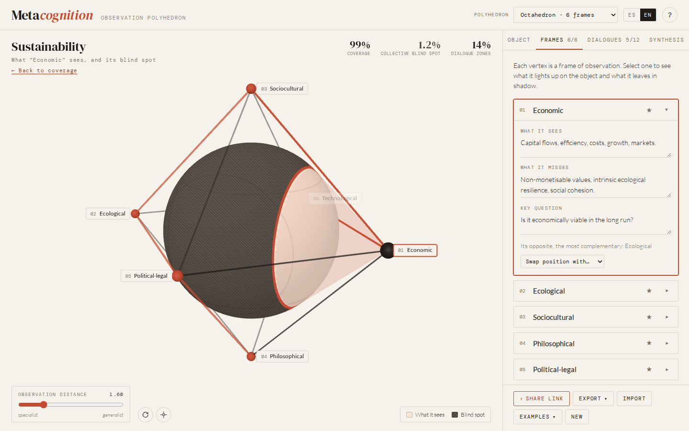

<p align="right"><a href="README.md">Español</a> · <b>English</b></p>

# Metacognition

**Observation polyhedron.** An interactive tool for looking at an object of study from several frames, and for recognising what each one sees, what none of them sees, and where they can talk to each other.

**[→ Open the tool](https://pahernandezceh.github.io/metacognition/?lang=en)**

[](https://github.com/pahernandezceh/metacognition/actions/workflows/ci.yml)
[](LICENSE)
[](LICENSE-CONTENT)



## The idea

No object of study can be seen whole from a single place. Every discipline, theory, interest or history is a **frame of observation**: it lights up part of the object and leaves another part in shadow. The problem is not having a frame (one always does) but forgetting that one is looking from it.

*Metacognition* turns that intuition into a figure you can explore. The object of study is a sphere; the frames sit on the vertices of a regular polyhedron around it. From each vertex only part of the sphere can be seen. Bringing them together reveals three things that none of them shows on its own:

- **what each frame sees and what it misses** (its blind spot);
- **dialogue zones**, where two or more frames look at the same thing;
- **the collective blind spot**, what no frame reaches: questions that fall between disciplines.

Thinking about how we think (*metacognition*) starts there: acknowledging where we look from, and who can see what we cannot.

## How to read the polyhedron

| Element | Stands for |
|---|---|
| **Sphere** | The object of study. |
| **Vertex** | A frame of observation: discipline, theory, stakeholder, value. |
| **Lit area** | What that frame can see from where it stands. |
| **Shadow** | Its blind spot. No frame sees the whole object. |
| **Edge** | A dialogue between neighbouring frames: the zone both of them see. |
| **Opposite vertices** | The most complementary frames: each sees what the other cannot. |
| **Observation distance** | From specialist (in depth, but little) to generalist (broad, but shallow). |
| **Collective blind spot** | What no frame sees. |

The geometry is not decorative. From a point at distance *d* from the centre of a unit sphere you see a cap of angular radius arccos(1/*d*), that is, a fraction (1 − 1/*d*)/2 of the surface: **never half of it**. With four frames (tetrahedron) at the default distance, a quarter of the object remains unseen; with twelve (icosahedron) everything is covered. Each pixel of the sphere is coloured in a shader according to how many frames see it, and coverage figures are computed over 8,000 points spread evenly over the sphere.

## What you can do

- Choose any of the five Platonic solids: **4, 6, 8, 12 or 20 frames**.
- Name each frame and note **what it sees, what it misses and its key question**.
- Tap a vertex to see **its light and its shadow**; tap an edge to see **the zone two frames share**.
- Note on each edge the **tension** between two frames and **what emerges** from their dialogue.
- Move the **observation distance** and watch coverage, the collective blind spot and dialogue zones change.
- Optionally mark a **main frame** (your own) and get a **dialogue path**: who to talk to, and in what order, to see more.
- Move frames between vertices (their dialogues follow them) and switch polyhedra without losing what you wrote.
- Write a **synthesis** and gather the key questions of all frames.
- **Export** a Markdown report, print it or save it as PDF, download a PNG image or the data as JSON.
- **Share a link** that carries the whole configuration.
- Use the interface in **Spanish or English**, on desktop, tablet or phone.

Two complete examples are included: *Sustainability* (octahedron, six frames) and *Artificial intelligence in education* (tetrahedron, four frames).

## Uses

### In the classroom

A 60–90 minute workshop works well like this:

1. The group agrees on an object of study and a polyhedron (the tetrahedron or octahedron are good starting points).
2. Each team takes on a frame and writes what it sees, what it misses and its key question.
3. Neighbouring teams discuss their shared edge: where do they clash? What appears when they look together?
4. In plenary, look at the collective blind spot: which frame is missing? Try a larger polyhedron.
5. Each person marks their main frame, reviews their dialogue path and writes a short synthesis.
6. Export the report (PDF or Markdown) as the workshop's output.

Discussion prompts: *Which frame was hardest to inhabit? Which edge produced the most tension? What changed when the observation distance moved closer or further away?*

### In research

To map disciplinary perspectives on a problem, spot gaps before designing a study, prepare an interdisciplinary team's conversation, or document the assumptions behind each approach. The exported JSON is human-readable and can be versioned alongside the rest of a project.

### For personal reflection

Marking your own main frame turns the polyhedron into a mirror: it shows which part of the object lies outside your usual gaze, and which other frames to talk to first.

## Theoretical resonances

The tool is in conversation with several traditions that, by different routes, reach related intuitions:

- **Metacognition.** The term, coined by John Flavell, names knowledge about and regulation of one's own cognitive processes: knowing how one knows.
- **Complex thought.** Edgar Morin proposes a *knowledge of knowledge* that brings the knowing subject back into what is known, and distrusts disciplines that become blind to whatever falls outside their cut.
- **Second-order observation.** For Heinz von Foerster and Niklas Luhmann, every observation relies on a distinction it cannot see while using it: its blind spot. Another observation can point it out, at the cost of having its own.
- **Situated knowledges.** Donna Haraway argues that every gaze is partial and situated, and that objectivity is not a view from nowhere but the accountable connection of partial perspectives.

### References

- Flavell, J. H. (1979). Metacognition and cognitive monitoring: A new area of cognitive–developmental inquiry. *American Psychologist, 34*(10), 906–911. https://doi.org/10.1037/0003-066X.34.10.906
- Haraway, D. (1988). Situated knowledges: The science question in feminism and the privilege of partial perspective. *Feminist Studies, 14*(3), 575–599. https://doi.org/10.2307/3178066
- Luhmann, N. (1993). Deconstruction as second-order observing. *New Literary History, 24*(4), 763–782. https://doi.org/10.2307/469391
- Morin, E. (1986). *La Méthode 3. La Connaissance de la connaissance*. Seuil.
- von Foerster, H. (2003). *Understanding understanding: Essays on cybernetics and cognition*. Springer. https://doi.org/10.1007/b97451

## Privacy

Everything happens in the browser. What you write is saved automatically in your browser's local storage and is never sent to any server. Share links carry the compressed configuration after the `#` of the address, a part browsers do not send to the server. Fonts and the 3D library ship with the repository, so the page makes no third-party requests.

## Development

A static page with no build step: HTML, CSS and JavaScript modules.

```bash
npm install        # development tools only
npm start          # http://localhost:8080
npm test           # geometry and state tests (node --test)
```

```
index.html            page structure
css/                  styles and fonts
js/geometry.js        Platonic solids and visibility model (pure, tested)
js/state.js           state, validation, share links, local saving
js/scene.js           3D view with three.js and the light-and-shadow shader
js/ui.js              side panel (object, frames, dialogues, synthesis)
js/report.js          Markdown report, printable version and PNG image
js/examples.js        examples in Spanish and English
js/i18n.js            interface strings
js/main.js            entry point
vendor/               bundled three.js (npm run build:vendor)
tests/                unit tests
```

`vendor/three.bundle.js` contains only the parts of [three.js](https://threejs.org) the view uses, and is regenerated with `npm run build:vendor`. To inspect the state from the console, open the page with `?debug`.

### Publishing on GitHub Pages

The `.github/workflows/pages.yml` workflow publishes the site on every push to `main`. It only needs to be enabled once under **Settings → Pages → Build and deployment → Source: GitHub Actions**.

## License

- **Code:** [MIT](LICENSE).
- **Texts, examples, documentation and the conceptual model:** [CC BY 4.0](LICENSE-CONTENT). Reuse and adapt them with attribution.
- **Third parties:** three.js (MIT); Lato, DM Serif Display and DM Mono ([SIL Open Font License 1.1](assets/fonts/OFL.txt)).

## How to cite

If you use the tool or its ideas in academic work, you can cite it as follows (the same data is in [`CITATION.cff`](CITATION.cff)):

> pahernandezceh. (2026). *Metacognition: Observation polyhedron* (Version 1.0.0) [Computer software]. https://github.com/pahernandezceh/metacognition
