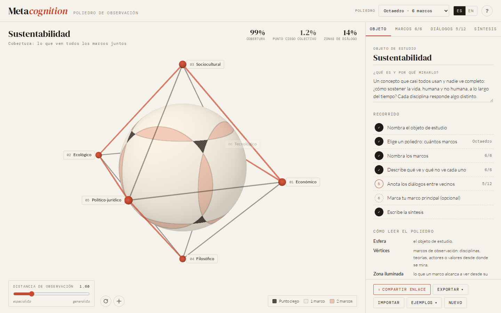

<p align="right"><b>Español</b> · <a href="README.en.md">English</a></p>

# Metacognition

**Poliedro de observación.** Una herramienta interactiva para mirar un objeto de estudio desde varios marcos y reconocer lo que cada uno ve, lo que ninguno ve y dónde pueden dialogar.

**[→ Abrir la herramienta](https://pahernandezceh.github.io/metacognition/)**

[](https://github.com/pahernandezceh/metacognition/actions/workflows/ci.yml)
[](LICENSE)
[](LICENSE-CONTENT)



## La idea

Ningún objeto de estudio se ve completo desde un solo lugar. Cada disciplina, teoría, interés o historia es un **marco de observación**: ilumina una parte del objeto y deja otra en sombra. El problema no es tener un marco (siempre se tiene uno), sino olvidar que se está mirando desde él.

*Metacognition* convierte esa intuición en una figura que se puede explorar. El objeto de estudio es una esfera; los marcos ocupan los vértices de un poliedro regular a su alrededor. Desde cada vértice se ve solo una parte de la esfera. Al reunirlos aparecen tres cosas que no se ven desde ninguno por separado:

- **lo que cada marco ve y lo que no** (su punto ciego);
- **las zonas de diálogo**, donde dos o más marcos miran lo mismo;
- **el punto ciego colectivo**, lo que ningún marco alcanza: preguntas que caen entre disciplinas.

Pensar sobre cómo pensamos (*metacognición*) empieza por ahí: reconocer desde dónde miramos y quién puede ver lo que nosotros no.

## Cómo leer el poliedro

| Elemento | Representa |
|---|---|
| **Esfera** | El objeto de estudio. |
| **Vértice** | Un marco de observación: disciplina, teoría, actor, valor. |
| **Zona iluminada** | Lo que ese marco alcanza a ver desde su posición. |
| **Sombra** | Su punto ciego. Ningún marco ve el objeto completo. |
| **Arista** | Un diálogo entre marcos vecinos: la zona que ambos ven. |
| **Vértices opuestos** | Los marcos más complementarios: cada uno ve lo que el otro no. |
| **Distancia de observación** | De especialista (ve a fondo, pero poco) a generalista (ve amplio, pero superficial). |
| **Punto ciego colectivo** | Lo que no ve ningún marco. |

La geometría no es decorativa. Desde un punto a distancia *d* del centro de una esfera de radio 1 se ve un casquete de radio angular arccos(1/*d*), es decir, una fracción (1 − 1/*d*)/2 de la superficie: **nunca la mitad**. Con cuatro marcos (tetraedro) a la distancia por omisión queda sin ver una cuarta parte del objeto; con doce (icosaedro) se cubre todo. Cada píxel de la esfera se colorea en un *shader* según cuántos marcos lo ven, y las cifras de cobertura se calculan sobre 8 000 puntos repartidos uniformemente sobre la esfera.

## Qué se puede hacer

- Elegir entre los cinco sólidos platónicos: **4, 6, 8, 12 o 20 marcos**.
- Nombrar cada marco y anotar **qué ve, qué no ve y su pregunta clave**.
- Tocar un vértice para ver **su luz y su sombra**; tocar una arista para ver **la zona que comparten** dos marcos.
- Anotar en cada arista la **tensión** entre dos marcos y **lo que emerge** de su diálogo.
- Mover la **distancia de observación** y ver cómo cambian la cobertura, el punto ciego colectivo y las zonas de diálogo.
- Marcar, si se quiere, un **marco principal** (el propio) y obtener una **ruta de diálogo**: con quién conversar, y en qué orden, para ver más.
- Cambiar marcos de vértice (sus diálogos los acompañan) y cambiar de poliedro sin perder lo escrito.
- Escribir una **síntesis** y reunir las preguntas clave de todos los marcos.
- **Exportar** un informe en Markdown, imprimirlo o guardarlo como PDF, descargar una imagen PNG o los datos en JSON.
- **Compartir un enlace** que contiene toda la configuración.
- Usar la interfaz en **español o inglés**. Funciona en computadora, tableta y teléfono.

Incluye dos ejemplos completos: *Sustentabilidad* (octaedro, seis marcos) e *Inteligencia artificial en la educación* (tetraedro, cuatro marcos).

## Usos

### En el aula

Un taller de 60 a 90 minutos funciona bien así:

1. El grupo acuerda un objeto de estudio y un poliedro (el tetraedro o el octaedro son buenos para empezar).
2. Cada equipo asume un marco y escribe qué ve, qué no ve y su pregunta clave.
3. Los equipos vecinos discuten su arista: ¿dónde chocan? ¿qué aparece cuando miran juntos?
4. En plenaria se mira el punto ciego colectivo: ¿qué marco falta? Se prueba un poliedro mayor.
5. Cada persona marca su marco principal, revisa su ruta de diálogo y escribe una síntesis breve.
6. Se exporta el informe (PDF o Markdown) como producto del taller.

Preguntas para la discusión: *¿Qué marco nos resultó más difícil de habitar? ¿Qué arista generó más tensión? ¿Qué cambió al acercar o alejar la distancia de observación?*

### En investigación

Para mapear las perspectivas disciplinares sobre un problema, detectar huecos antes de diseñar un estudio, preparar la conversación de un equipo interdisciplinario o documentar los supuestos de cada enfoque. El archivo JSON exportado es legible y se puede versionar junto con el resto del proyecto.

### Para la reflexión personal

Marcar el propio marco principal convierte el poliedro en un espejo: muestra qué parte del objeto queda fuera de la mirada habitual y con qué otros marcos conviene dialogar primero.

## Resonancias teóricas

La herramienta dialoga con varias tradiciones que, por caminos distintos, llegan a intuiciones cercanas:

- **Metacognición.** El término, acuñado por John Flavell, nombra el conocimiento y la regulación de los propios procesos cognitivos: saber cómo se sabe.
- **Pensamiento complejo.** Edgar Morin propone un *conocimiento del conocimiento* que reintroduce al sujeto que conoce en aquello que conoce, y desconfía de las disciplinas que se vuelven ciegas a lo que queda fuera de su recorte.
- **Observación de segundo orden.** Para Heinz von Foerster y Niklas Luhmann, toda observación opera con una distinción que no puede ver mientras la usa: su punto ciego. Otra observación puede señalarlo, a costa de tener el suyo.
- **Conocimientos situados.** Donna Haraway sostiene que toda mirada es parcial y situada, y que la objetividad no es una vista desde ninguna parte, sino la conexión responsable entre perspectivas parciales.

### Referencias

- Flavell, J. H. (1979). Metacognition and cognitive monitoring: A new area of cognitive–developmental inquiry. *American Psychologist, 34*(10), 906–911. https://doi.org/10.1037/0003-066X.34.10.906
- Haraway, D. (1988). Situated knowledges: The science question in feminism and the privilege of partial perspective. *Feminist Studies, 14*(3), 575–599. https://doi.org/10.2307/3178066
- Luhmann, N. (1993). Deconstruction as second-order observing. *New Literary History, 24*(4), 763–782. https://doi.org/10.2307/469391
- Morin, E. (1988). *El método III. El conocimiento del conocimiento*. Cátedra. (Obra original publicada en 1986).
- von Foerster, H. (2003). *Understanding understanding: Essays on cybernetics and cognition*. Springer. https://doi.org/10.1007/b97451

## Privacidad

Todo ocurre en el navegador. Lo que escribes se guarda automáticamente en el almacenamiento local de tu navegador y no se envía a ningún servidor. Los enlaces para compartir llevan la configuración comprimida después del signo `#` de la dirección, una parte que los navegadores no envían al servidor. Las tipografías y la biblioteca 3D están incluidas en el repositorio, así que la página no hace peticiones a terceros.

## Desarrollo

Es una página estática sin paso de compilación: HTML, CSS y módulos de JavaScript.

```bash
npm install        # solo herramientas de desarrollo
npm start          # http://localhost:8080
npm test           # pruebas de geometría y de estado (node --test)
```

```
index.html            estructura de la página
css/                  estilos y tipografías
js/geometry.js        sólidos platónicos y modelo de visibilidad (puro, probado)
js/state.js           estado, validación, enlaces para compartir, guardado local
js/scene.js           vista 3D con three.js y el shader de luz y sombra
js/ui.js              panel lateral (objeto, marcos, diálogos, síntesis)
js/report.js          informe Markdown, versión imprimible e imagen PNG
js/examples.js        ejemplos en español e inglés
js/i18n.js            textos de la interfaz
js/main.js            punto de entrada
vendor/               three.js empaquetado (npm run build:vendor)
tests/                pruebas unitarias
```

`vendor/three.bundle.js` contiene solo las partes de [three.js](https://threejs.org) que usa la vista y se regenera con `npm run build:vendor`. Para inspeccionar el estado desde la consola, abre la página con `?debug`.

### Publicar en GitHub Pages

El flujo `.github/workflows/pages.yml` publica el sitio en cada *push* a `main`. Solo hay que activarlo una vez en **Settings → Pages → Build and deployment → Source: GitHub Actions**.

## Licencia

- **Código:** [MIT](LICENSE).
- **Textos, ejemplos, documentación y el modelo conceptual:** [CC BY 4.0](LICENSE-CONTENT). Se pueden reutilizar y adaptar citando la fuente.
- **Terceros:** three.js (MIT); Lato, DM Serif Display y DM Mono ([SIL Open Font License 1.1](assets/fonts/OFL.txt)).

## Cómo citar

Si usas la herramienta o sus ideas en un trabajo académico, puedes citarla así (los datos también están en [`CITATION.cff`](CITATION.cff)):

> pahernandezceh. (2026). *Metacognition: Poliedro de observación* (Versión 1.0.0) [Software]. https://github.com/pahernandezceh/metacognition
